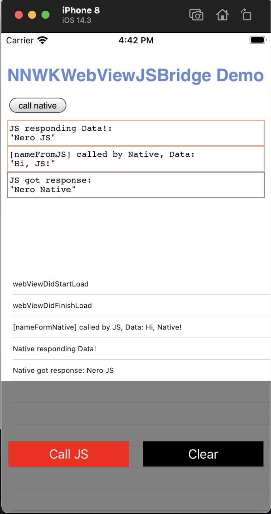

# WKWebViewJSBridge

[](https://github.com/apple/swift)
[](https://raw.githubusercontent.com/YiHuaXie/NNWKWebViewJSBridge/master/LICENSE)
[](https://cocoapods.org/pods/NNWKWebViewJSBridge)

## 简介

在看了[WebViewJavascriptBridge](https://github.com/marcuswestin/WebViewJavascriptBridge)的项目，我希望可以用swift去实现一个javascript bridge，所以写了这个项目。该项目是基于WebViewJavascriptBridge实现，仅支持WKWebView。



## 使用

### Native端

#### 1. 初始化

使用WKWebView初始化bridge对象

```swift
 let webView = WKWebView(frame: .zero, configuration: WKWebViewConfiguration())
 bridge = WKWebViewJSBridge(webView: webView)
```

#### 2. Javascript调用Native

Native注册函数给Javascript调用

```swift
bridge.register(handlerName: "nameFromNative") { [weak self] (data, callback) in
    self?.data.append("[nameFormNative] called by JS, Data: \(data!)")
    self?.data.append("Native responding Data!")
    self?.tableView.reloadData()
    callback?("Nero Native")
}
```

#### 3. Native调用Javascript

Native调用Javascript

```swift
bridge.call(handlerName: "JSBridgeBegin")
```

### Javascript端

#### 1. 初始化

复制以下代码到你的项目中

```js
function setupWKWebViewJSBridge(callback) {
	if (window.WKWebViewJSBridge) {
		return callback(WKWebViewJSBridge);
	}

	if (window.WKWebViewJSBridgeCallbacks) {
		return window.WKWebViewJSBridgeCallbacks.push(callback);
	}
	window.WKWebViewJSBridgeCallbacks = [callback];

	window.webkit.messageHandlers.iOS_InjectJavascript.postMessage(null);
}
```

#### 2. Javascript注册函数或者调用Native函数

调用`setupWKWebViewJSBridge`函数后用bridge来注册Handlers以及调用Native Handlers。

```js
setupWKWebViewJSBridge(bridge => {
	bridge.registerHandler('JSBridgeBegin', (data, responseCallback) => {
		log('JSBridge Begin, Data', data, true);
	});

	bridge.registerHandler('nameFromJS', (data, responseCallback) => {
		log('[nameFromJS] called by Native, Data', data, true);
		log('JS responding Data!', 'Nero JS', true);
		responseCallback('Nero JS');
	});
});
```

## 要求

`iOS 9.0+`。

## 安装

```ruby
pod 'NNWKWebViewJSBridge'
```

## 作者

+ 邮箱：xyh30902@163.com

## 许可证

NNWKWebViewJSBridge 基于 MIT 许可证，查看 LICENSE 文件了解更多信息。
